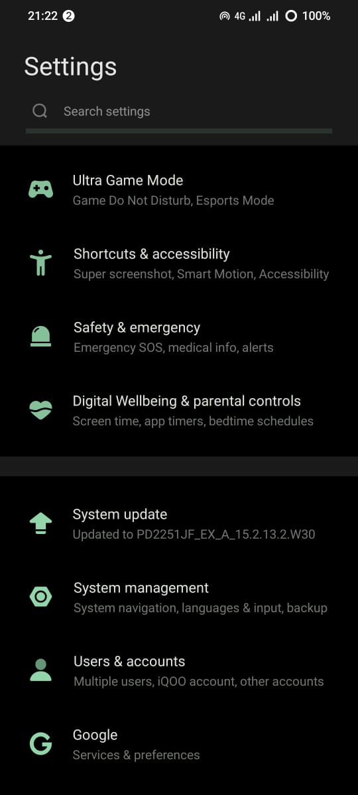
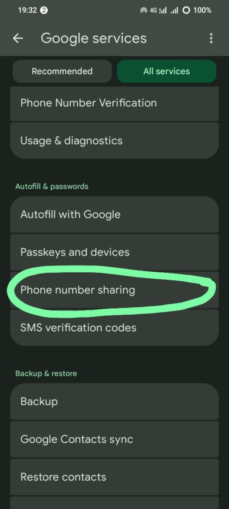

# React Native Android Phone Number Hint

[](https://www.npmjs.com/package/@shayrn/react-native-android-phone-number-hint)
[](LICENSE)

A simple and lightweight React Native package that allows Android users to **select their SIM-based phone number** using the native **Google Phone Number Hint Picker**. This improves user experience by avoiding manual number entry.

---

## 🧩 What is Phone Number Hint API?

The **Phone Number Hint API** (part of Google Identity Services) allows apps to request the user’s phone number using a secure, native picker. It returns the number linked to the device SIM without requiring any permissions. This is useful for onboarding, OTP flows, and autofill use cases.

---

## ✨ Features

- ✅ Fetch SIM-based phone number using Android’s native dialog
- 🚫 No runtime permissions required
- ⚡ Fast & lightweight (uses Play Services)
- 📦 Built with TurboModules
- 📱 Supports Android (API 24+)

---

## 🚀 Getting Started

### 📦 Install the package

```bash
npm install @shayrn/react-native-android-phone-number-hint
# or
yarn add @shayrn/react-native-android-phone-number-hint
# or
npx expo install @shayrn/react-native-android-phone-number-hint
```

> **Important:** This package will **not** work with Expo Go.  
> To test it, use either:
>
> - A custom development build (via EAS)
> - A bare React Native app

### ⚙️ Android Setup (Manual Linking)

#### 1. Add Play Services Auth dependency

In `android/app/build.gradle`:

```gradle
dependencies {
  implementation 'com.google.android.gms:play-services-auth:21.3.0'
}
```

In `android/app/src/main/java/androidphonenumberhint/example/MainApplication.kt`:

```kt
import com.androidphonenumberhint.AndroidPhoneNumberHintPackage // NOTE: Add this line
...

override fun getPackages(): List<ReactPackage> {
    return PackageList(this).packages.apply {
        // Manually add packages that can't be auto-linked
        add(AndroidPhoneNumberHintPackage()) // NOTE: add this line
    }
}
```

#### 2. Ensure `minSdkVersion` is 24 or higher

In `android/build.gradle` or your root `gradle.properties`:

```properties
minSdkVersion=24
targetSdkVersion=34
compileSdkVersion=35
```

#### 3. For Turborepo/Monorepo

In your app’s `settings.gradle`:

```gradle
include(":react-native-android-phone-number-hint")
project(":react-native-android-phone-number-hint").projectDir = new File(rootDir, "../../packages/react-native-android-phone-number-hint/android")
```

And ensure `pluginManagement` includes:

```gradle
pluginManagement {
  includeBuild("../../node_modules/react-native-gradle-plugin")
}
```

---

## 🛠️ End to End Fully Feature Usage Example

### Basic Usage (Recommended)

```tsx
import {
  showPhoneNumberHint,
  PhoneNumberHintErrorCodes,
} from '@shayrn/react-native-android-phone-number-hint';

// Simple usage - handle errors in your app
const getPhoneNumber = async () => {
  try {
    const phoneNumber = await showPhoneNumberHint();
    console.log('Phone number:', phoneNumber);
  } catch (error: any) {
    switch (error.code) {
      case PhoneNumberHintErrorCodes.USER_CANCELLED:
        // User dismissed the picker - this is normal, no action needed
        break;
      case PhoneNumberHintErrorCodes.RESOLUTION_REQUIRED:
      case PhoneNumberHintErrorCodes.API_NOT_CONNECTED:
        // Phone number hints disabled - show your own custom UI
        Alert.alert(
          'Enable Phone Number Hints',
          'Please enable phone number sharing in Settings → Google → Phone number sharing',
          [{ text: 'OK' }]
        );
        break;
      case PhoneNumberHintErrorCodes.NETWORK_ERROR:
        Alert.alert('Network Error', 'Please check your connection');
        break;
      default:
        console.error('Phone hint error:', error.message);
    }
  }
};
```

### With Built-in Guidance Dialog (Optional)

If you prefer the library to show a guidance dialog when phone hints are unavailable:

```tsx
import { showPhoneNumberHint } from '@shayrn/react-native-android-phone-number-hint';

// With built-in guidance dialog enabled
const getPhoneNumber = async () => {
  try {
    const phoneNumber = await showPhoneNumberHint({
      showGuidanceDialog: true, // Shows native dialog with settings instructions
    });
    console.log('Phone number:', phoneNumber);
  } catch (error: any) {
    // Error is still thrown, but user will have seen the guidance dialog
    console.log('Error code:', error.code);
  }
};
```

### API Reference

#### `showPhoneNumberHint(options?)`

Shows the native Android phone number hint picker.

**Parameters:**

| Option               | Type      | Default | Description                                                        |
| -------------------- | --------- | ------- | ------------------------------------------------------------------ |
| `showGuidanceDialog` | `boolean` | `false` | Whether to show a guidance dialog when phone hints are unavailable |

**Returns:** `Promise<string>` - The selected phone number

**Error Codes:**

| Code                  | Description                                        |
| --------------------- | -------------------------------------------------- |
| `USER_CANCELLED`      | User dismissed the phone number picker             |
| `RESOLUTION_REQUIRED` | Phone number hints are disabled in device settings |
| `API_NOT_CONNECTED`   | Google Play Services not connected or unavailable  |
| `NETWORK_ERROR`       | Network connectivity issue                         |
| `SIGN_IN_REQUIRED`    | Google account sign-in required                    |
| `DEVELOPER_ERROR`     | API configuration error                            |
| `NO_ACTIVITY`         | No active Android activity available               |
| `ALREADY_IN_PROGRESS` | A hint request is already in progress              |
| `INTENT_ERROR`        | Failed to launch the phone number picker           |
| `GET_PHONE_ERROR`     | Failed to retrieve phone number from result        |
| `UNKNOWN_ERROR`       | Unexpected error occurred                          |

### Complete Example with All Features

### Complete Example with All Features

```tsx
import { useEffect, useState } from 'react';
import {
  StyleSheet,
  Text,
  View,
  TouchableOpacity,
  Alert,
  ActivityIndicator,
} from 'react-native';
import {
  showPhoneNumberHint,
  PhoneNumberHintErrorCodes,
} from '@shayrn/react-native-android-phone-number-hint';

export default function App() {
  const [phoneNumber, setPhoneNumber] = useState('');
  const [loading, setLoading] = useState(false);
  const [error, setError] = useState('');
  const [_, setHasAttempted] = useState(false);

  const requestPhoneNumber = async () => {
    setLoading(true);
    setError('');
    setHasAttempted(true);

    try {
      const _phoneNumber = await showPhoneNumberHint();
      setPhoneNumber(_phoneNumber);
    } catch (err: any) {
      console.log('🚀 ~ requestPhoneNumber ~ err:', err);

      // Handle different error types
      if (err.code === 'USER_CANCELLED') {
        setError('Phone number selection was cancelled');
      } else if (
        err.code === 'RESOLUTION_REQUIRED' ||
        err.code === 'API_NOT_CONNECTED'
      ) {
        setError(
          'Phone number hints are disabled. Please enable in Settings → Google → Phone number sharing'
        );
      } else if (err.code === 'NO_ACTIVITY') {
        setError('App is not ready. Please try again');
      } else if (err.code === 'NETWORK_ERROR') {
        setError('Network error. Please check your connection and try again');
      } else if (err.code === 'SIGN_IN_REQUIRED') {
        setError('Please sign in to your Google account to use this feature');
      } else {
        setError('Unable to retrieve phone number. Please try again');
      }
    } finally {
      setLoading(false);
    }
  };

  useEffect(() => {
    requestPhoneNumber();
  }, []);

  const showErrorDetails = () => {
    Alert.alert(
      'Troubleshooting',
      'To use phone number hints:\n\n• Go to Settings → Google → Phone number sharing and enable it\n• Ensure you have a phone number saved in your Google account\n• Make sure Google Play Services is updated\n• Try restarting the app if issues persist',
      [{ text: 'OK' }]
    );
  };

  const renderContent = () => {
    if (loading) {
      return (
        <View style={styles.contentContainer}>
          <ActivityIndicator size="large" color="#4285F4" />
          <Text style={styles.loadingText}>Requesting phone number...</Text>
        </View>
      );
    }

    if (phoneNumber) {
      return (
        <View style={styles.contentContainer}>
          <View style={styles.successIcon}>
            <Text style={styles.successIconText}>✓</Text>
          </View>
          <Text style={styles.successTitle}>Phone Number Retrieved</Text>
          <View style={styles.phoneContainer}>
            <Text style={styles.phoneNumber}>{phoneNumber}</Text>
          </View>
          <TouchableOpacity
            style={styles.secondaryButton}
            onPress={requestPhoneNumber}
          >
            <Text style={styles.secondaryButtonText}>Try Another Number</Text>
          </TouchableOpacity>
        </View>
      );
    }

    if (error) {
      return (
        <View style={styles.contentContainer}>
          <View style={styles.errorIcon}>
            <Text style={styles.errorIconText}>⚠</Text>
          </View>
          <Text style={styles.errorTitle}>Unable to Get Phone Number</Text>
          <Text style={styles.errorMessage}>{error}</Text>
          <TouchableOpacity
            style={styles.primaryButton}
            onPress={requestPhoneNumber}
          >
            <Text style={styles.primaryButtonText}>Try Again</Text>
          </TouchableOpacity>
          <TouchableOpacity
            style={styles.helpButton}
            onPress={showErrorDetails}
          >
            <Text style={styles.helpButtonText}>Need Help?</Text>
          </TouchableOpacity>
        </View>
      );
    }

    // Initial state (shouldn't happen due to useEffect, but just in case)
    return (
      <View style={styles.contentContainer}>
        <Text style={styles.title}>Phone Number Hint</Text>
        <Text style={styles.subtitle}>Get your phone number from Google</Text>
        <TouchableOpacity
          style={styles.primaryButton}
          onPress={requestPhoneNumber}
        >
          <Text style={styles.primaryButtonText}>Get Phone Number</Text>
        </TouchableOpacity>
      </View>
    );
  };

  return (
    <View style={styles.container}>
      <View style={styles.header}>
        <Text style={styles.appTitle}>Phone Number Hint Demo</Text>
      </View>
      {renderContent()}
    </View>
  );
}

const styles = StyleSheet.create({
  container: {
    flex: 1,
    backgroundColor: '#f8f9fa',
  },
  header: {
    backgroundColor: '#4285F4',
    paddingTop: 50,
    paddingBottom: 20,
    paddingHorizontal: 20,
    shadowColor: '#000',
    shadowOffset: { width: 0, height: 2 },
    shadowOpacity: 0.1,
    shadowRadius: 4,
    elevation: 3,
  },
  appTitle: {
    fontSize: 24,
    fontWeight: 'bold',
    color: 'white',
    textAlign: 'center',
  },
  contentContainer: {
    flex: 1,
    justifyContent: 'center',
    alignItems: 'center',
    paddingHorizontal: 30,
  },
  title: {
    fontSize: 28,
    fontWeight: 'bold',
    color: '#333',
    marginBottom: 8,
    textAlign: 'center',
  },
  subtitle: {
    fontSize: 16,
    color: '#666',
    marginBottom: 40,
    textAlign: 'center',
  },
  loadingText: {
    fontSize: 16,
    color: '#666',
    marginTop: 16,
    textAlign: 'center',
  },
  successIcon: {
    width: 80,
    height: 80,
    borderRadius: 40,
    backgroundColor: '#4CAF50',
    justifyContent: 'center',
    alignItems: 'center',
    marginBottom: 24,
  },
  successIconText: {
    fontSize: 40,
    color: 'white',
    fontWeight: 'bold',
  },
  successTitle: {
    fontSize: 24,
    fontWeight: 'bold',
    color: '#4CAF50',
    marginBottom: 20,
    textAlign: 'center',
  },
  phoneContainer: {
    backgroundColor: 'white',
    paddingHorizontal: 24,
    paddingVertical: 16,
    borderRadius: 12,
    borderWidth: 2,
    borderColor: '#4CAF50',
    marginBottom: 30,
    shadowColor: '#000',
    shadowOffset: { width: 0, height: 2 },
    shadowOpacity: 0.1,
    shadowRadius: 4,
    elevation: 3,
  },
  phoneNumber: {
    fontSize: 20,
    fontWeight: 'bold',
    color: '#333',
    textAlign: 'center',
  },
  errorIcon: {
    width: 80,
    height: 80,
    borderRadius: 40,
    backgroundColor: '#FF9800',
    justifyContent: 'center',
    alignItems: 'center',
    marginBottom: 24,
  },
  errorIconText: {
    fontSize: 40,
    color: 'white',
    fontWeight: 'bold',
  },
  errorTitle: {
    fontSize: 24,
    fontWeight: 'bold',
    color: '#FF9800',
    marginBottom: 16,
    textAlign: 'center',
  },
  errorMessage: {
    fontSize: 16,
    color: '#666',
    textAlign: 'center',
    marginBottom: 30,
    lineHeight: 24,
  },
  primaryButton: {
    backgroundColor: '#4285F4',
    paddingHorizontal: 32,
    paddingVertical: 16,
    borderRadius: 12,
    marginBottom: 16,
    shadowColor: '#4285F4',
    shadowOffset: { width: 0, height: 4 },
    shadowOpacity: 0.3,
    shadowRadius: 8,
    elevation: 6,
  },
  primaryButtonText: {
    color: 'white',
    fontSize: 18,
    fontWeight: 'bold',
    textAlign: 'center',
  },
  secondaryButton: {
    backgroundColor: 'white',
    paddingHorizontal: 32,
    paddingVertical: 16,
    borderRadius: 12,
    borderWidth: 2,
    borderColor: '#4285F4',
    shadowColor: '#000',
    shadowOffset: { width: 0, height: 2 },
    shadowOpacity: 0.1,
    shadowRadius: 4,
    elevation: 3,
  },
  secondaryButtonText: {
    color: '#4285F4',
    fontSize: 16,
    fontWeight: 'bold',
    textAlign: 'center',
  },
  helpButton: {
    paddingHorizontal: 16,
    paddingVertical: 12,
  },
  helpButtonText: {
    color: '#4285F4',
    fontSize: 16,
    textAlign: 'center',
    textDecorationLine: 'underline',
  },
});
```

---

## 📷 Demo Example

> 

---

## Troubleshoot Phone Number Permissions

Follow these steps to enable phone number sharing on Android:

1. Open **Settings**  
   Scroll down and tap on **Google**  
   

2. Tap on **Phone number sharing**  
   

3. Turn on the **Phone number sharing** toggle  
   

---

## ✅ Compatibility

| Platform | Support                |
| -------- | ---------------------- |
| Android  | ✅ Supported (API 24+) |
| iOS      | ❌ Not supported       |

> 📱 Works only on physical Android devices with SIM and Google Play Services installed.

---

## 🧠 Notes

- Uses [Google Identity Services](https://developers.google.com/identity) under the hood
- Requires no special permissions (like `READ_PHONE_STATE`)
- Phone number may return `null` if the user cancels or SIM not found

---

## 📄 License

MIT © 2025 \[Mahesh Muttinti]

---

## 🙌 Contributing

Got suggestions or bug fixes? PRs and issues are welcome!
👉 [GitHub Issues](https://github.com/maheshmuttintidev/react-native-android-phone-number-hint/issues)

---

## 💬 Questions?

Join the conversation:
👉 [GitHub Discussions](https://github.com/maheshmuttintidev/react-native-android-phone-number-hint/discussions)
